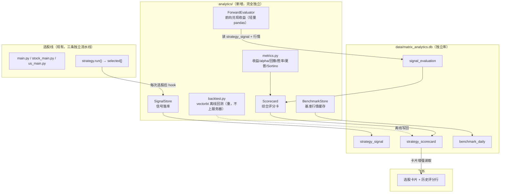

# Matrix 策略绩效分析与回测模块 | Analytics & Backtest

> 一个**完全独立**于选股流水线的绩效评估模块：把每次选股结果落库为「信号」，
> 随时间推移计算其真实兑现收益，对比基准得到 **超额收益 / 最大回撤 / 胜率 /
> 夏普 / Sortino**，汇总成每个策略的**综合评分卡**；并提供一套离线的
> vectorbt 历史回测引擎用于严谨复盘。最终目标：**每次推送飞书卡片时，能带上
> 该策略过去的真实收益与评分**。

本文档是**设计蓝图**，用于指导后续实现，不代表代码已落地。命名、字段、公式均可在
实现阶段微调，但整体分层与数据模型应保持稳定。

---

## 0. 为什么需要这个模块（现状差距）

| 能力 | 现状 | 说明 |
|---|---|---|
| strategy → signal 落库表 | ❌ 无 | 全库仅 `etf_daily / etf_basic / etf_metrics / stock_daily / stock_basic` |
| 发完飞书后持久化选股结果 | ❌ 无 | `notifier.send()` 只 build 卡片 + POST，**推完即丢** |
| 每策略建议持有天数 | ❌ 无 | `BaseStrategy` 仅 `webhook_key` + `run()→list[str]` |
| 收益 / alpha / 回撤 / 胜率 / 评分 | ❌ 无 | 没有任何绩效计算 |
| 回测库 | ❌ 无 | 依赖仅 pandas/requests/tickflow |

**关键结论**：现在选股结果推完就丢，没有任何历史信号可回溯。因此本模块第一块基石
必须是**信号落库**——没有它，一切前向绩效跟踪都无从谈起。

---

## 1. 目标与非目标

### 目标（Goals）
1. **信号持久化**：每次选股 → 落一条 `strategy_signal`（策略、市场、标的、入场日期、
   入场价、建议持有期）。
2. **前向兑现收益跟踪**：随行情推进，计算每条信号在多个持有期（如 5/10/20/60 日）
   的真实收益，并与基准同期收益对比得到超额。
3. **策略级评分卡**：把某策略近 N 条信号聚合为 **总收益 / 年化 / 超额 alpha /
   最大回撤 / 胜率 / 夏普 / Sortino / 综合评分**，落 `strategy_scorecard`。
4. **卡片增强**：推送选股卡片时，附上该策略最近一期评分卡的关键指标。
5. **离线历史回测**：提供基于 **vectorbt** 的历史复盘引擎，用于严谨的多年回测，
   结果缓存进库；**只在开发机/按需运行，不上生产服务器**。

### 非目标（Non-Goals）
- ❌ 不做实盘下单 / 撮合 / 资金管理。
- ❌ 不改动任何现有选股策略的**选股逻辑**（只在其外围加"记录 + 评估"）。
- ❌ 不引入实时行情；沿用 tickflow 免费档收盘后日线。
- ❌ 前向跟踪层**不引入 numba/vectorbt**（内存敏感，见 §12）。

---

## 2. 设计原则

1. **完全独立**：新建 `matrix_etf/analytics/` 包 + 独立数据库 `data/matrix_analytics.db`，
   与 ETF/A股/美股三条流水线解耦。选股线即使完全不接本模块也能正常跑；本模块
   通过一个极薄的 hook 读取选股结果。
2. **分层双腿**：
   - **前向跟踪腿**（轻量 pandas，每天在服务器上跑）→ 信号落库 + 兑现收益 + 评分卡。
   - **离线回测腿**（vectorbt，重，按需/本地跑）→ 历史复盘，结果写回同一套表。
3. **内存优先**：服务器仅 1.8G 内存 + 4G swap。前向跟踪腿只读"最近窗口"（复用
   §12 的读表优化思路），绝不全表载入；vectorbt 绝不上服务器。
4. **可回退**：所有绩效计算失败只记日志，绝不阻断选股/推送主流程（与现有
   `notifier` 的容错风格一致）。

---

## 3. 总体架构



**两腿的运行时机不同**：
- 前向跟踪腿：随每天选股/收盘后跑，轻量、常驻服务器。
- 离线回测腿：手动或本地定期跑，重、缓存结果，**不进 systemd 生产定时器**。

---

## 4. 数据模型（`data/matrix_analytics.db`）

独立库，横跨 ETF / A股 / 美股三个市场（用 `market` 字段区分）。

### 4.1 `strategy_signal` — 信号台账（一次选股一条标的一行）

```sql
CREATE TABLE IF NOT EXISTS strategy_signal (
    id                  INTEGER PRIMARY KEY AUTOINCREMENT,
    run_date            TEXT NOT NULL,      -- 选股运行日（信号产生日）YYYY-MM-DD
    market              TEXT NOT NULL,      -- 'ETF' | 'CN' | 'US'
    strategy            TEXT NOT NULL,      -- 策略类名，如 'RpsBreakoutStrategy'
    symbol              TEXT NOT NULL,      -- 标的代码，如 '600519.SH' / 'AAPL.US'
    entry_date          TEXT,              -- 实际入场交易日（run_date 的下一交易日）
    entry_price         REAL,              -- 入场价（entry_date 开盘价）
    suggested_hold_days INTEGER,           -- 该策略建议持有天数（见 §11）
    webhook_key         TEXT,              -- 冗余记录，便于溯源
    created_at          TEXT NOT NULL,     -- 落库时间戳
    UNIQUE(run_date, market, strategy, symbol)
);
CREATE INDEX IF NOT EXISTS idx_signal_strategy ON strategy_signal(market, strategy, run_date);
```

### 4.2 `signal_evaluation` — 单信号在各持有期的兑现表现

```sql
CREATE TABLE IF NOT EXISTS signal_evaluation (
    signal_id      INTEGER NOT NULL,       -- FK → strategy_signal.id
    horizon_days   INTEGER NOT NULL,       -- 持有期 5/10/20/60 …
    as_of_date     TEXT NOT NULL,          -- 计算时点（到期日或最新可得日）
    exit_price     REAL,                   -- 到期出场价
    ret            REAL,                   -- 标的区间收益率
    benchmark_ret  REAL,                   -- 同期基准收益率
    excess_ret     REAL,                   -- ret - benchmark_ret（超额）
    status         TEXT NOT NULL,          -- 'open'（未到期） | 'closed'（已到期）
    PRIMARY KEY (signal_id, horizon_days)
);
```

### 4.3 `strategy_scorecard` — 策略级聚合评分（每次评估刷新一行）

```sql
CREATE TABLE IF NOT EXISTS strategy_scorecard (
    market          TEXT NOT NULL,
    strategy        TEXT NOT NULL,
    as_of_date      TEXT NOT NULL,         -- 评分快照日
    window_days     INTEGER NOT NULL,      -- 统计窗口（如近 90 / 180 / 全部）
    sample_size     INTEGER,               -- 参与统计的（已收盘）信号数
    total_return    REAL,                  -- 组合累计收益
    ann_return      REAL,                  -- 年化收益
    excess_alpha    REAL,                  -- 相对基准的超额（见 §9）
    max_drawdown    REAL,                  -- 最大回撤（负数）
    win_rate        REAL,                  -- 胜率 [0,1]
    sharpe          REAL,
    sortino         REAL,
    composite_score REAL,                  -- 综合评分 0–100（见 §10）
    updated_at      TEXT NOT NULL,
    PRIMARY KEY (market, strategy, as_of_date, window_days)
);
```

### 4.4 `benchmark_daily` — 基准行情缓存

```sql
CREATE TABLE IF NOT EXISTS benchmark_daily (
    benchmark  TEXT NOT NULL,   -- '000300.SH' / 'SPY.US' …
    date       TEXT NOT NULL,
    close      REAL NOT NULL,
    PRIMARY KEY (benchmark, date)
);
```

---

## 5. 模块结构 `matrix_etf/analytics/`

```
matrix_etf/analytics/
├── __init__.py
├── db.py            # 独立引擎：建表 + 连接 matrix_analytics.db
├── signals.py       # SignalStore：record() 落库、查询未评估信号
├── benchmark.py     # BenchmarkStore：拉取/缓存基准日线（复用 tickflow 客户端）
├── metrics.py       # 纯函数：total_return / ann_return / max_drawdown /
│                    #          win_rate / sharpe / sortino / alpha（无 IO，易测）
├── forward.py       # ForwardEvaluator：读信号 + 行情 → 写 signal_evaluation
├── scorecard.py     # ScorecardBuilder：聚合 → 写 strategy_scorecard + 综合评分
├── report.py        # 供飞书卡片读取"最近评分行"的只读查询
└── backtest.py      # vectorbt 离线历史回测引擎（重，不上服务器）
```

`metrics.py` 是纯函数库（输入 pandas Series/DataFrame，输出标量），**不碰 IO**，
方便用 `hypothesis` 做性质测试。

---

## 6. 信号落库（对选股线的唯一侵入点）

三个 main 在 `strategy.run()` 得到 `selected` 后、`notifier.send()` 前后，加一个
**极薄且容错**的 hook：

```python
# stock_main.py 内，for strategy in strategies 循环中
selected = strategy.run()
if selected:
    try:
        signal_store.record(
            run_date=date.today().isoformat(),
            market="CN",
            strategy=type(strategy).__name__,
            symbols=selected,
            suggested_hold_days=getattr(strategy, "suggested_hold_days", None),
            webhook_key=strategy.webhook_key,
            engine=engine,   # 用于取入场价（下一交易日开盘价，或当日收盘价兜底）
        )
    except Exception as exc:      # 落库失败绝不阻断推送
        logger.warning(f"信号落库失败（不影响推送）：{exc}")
    notifier.send(...)
```

**入场价约定**：选股在 T 日收盘后运行，真实可执行的入场点是 **T+1 交易日开盘**。
落库时 `entry_date/entry_price` 可能要等 T+1 行情到位后由 `forward.py` 回填，
落库瞬间先只记 `run_date` 与标的，入场价延迟补齐（避免前视偏差 look-ahead）。

---

## 7. 前向兑现收益（`forward.py`，轻量、服务器每日跑）

每天收盘同步完行情后：
1. 查所有 `status='open'` 或尚未到期的信号。
2. 对每条信号：
   - 若入场价未补齐且 T+1 行情已到 → 回填 `entry_date/entry_price`。
   - 对每个 `horizon_days`（5/10/20/60）：若已到到期日 → 取出场价，算 `ret`；
     否则用最新价算"浮动收益"并保持 `status='open'`。
   - 用 `benchmark_daily` 取同期基准收益 → 算 `excess_ret`。
   - upsert 进 `signal_evaluation`。

**内存**：只按需读取涉及标的的最近窗口行情（复用 §12 思路），逐市场/逐批处理，
绝不全表载入。

---

## 8. 指标定义与公式（`metrics.py`）

先由每策略"当前持仓"构造一条**等权组合日收益序列** `r_t`：某信号从 `entry_date`
持有到 `entry_date + hold_days`，期间计入组合；每日组合收益 = 当日在持所有标的
日收益的等权均值。基于 `r_t` 与其净值曲线 `E_t = ∏(1+r_i)`：

| 指标 | 公式 | 说明 |
|---|---|---|
| 总收益 total_return | `∏(1+r_t) − 1` | 组合累计 |
| 年化 ann_return | `(1+total_return)^(252/T) − 1` | T=交易日数 |
| 波动率 vol | `std(r_t) · √252` | 年化 |
| 夏普 sharpe | `(ann_return − r_f) / vol` | `r_f` 无风险利率，默认 0 |
| Sortino | `(ann_return − r_f) / (下行标准差·√252)` | 只惩罚 `r_t<0` 的波动 |
| 最大回撤 max_drawdown | `min_t( E_t / max_{i≤t}E_i − 1 )` | 负数 |
| 胜率 win_rate | `#{已收盘信号 ret>0} / #{已收盘信号}` | 逐信号口径 |
| 超额 alpha | 见 §9 | 相对基准 |

> 无风险利率 `r_f`、年化交易日 252 均做成可配置项（美股/ A 股可分别设定）。

---

## 9. 基准对比与超额 alpha

| 市场 | 默认基准 | 备选 |
|---|---|---|
| A 股（CN） | 沪深300 `000300.SH` | 中证500 `000905.SH` |
| ETF | 沪深300 `000300.SH` | 与所选 ETF 风格匹配的宽基 |
| 美股（US） | 标普500 `SPY.US` | 纳指100 `QQQ.US` |

超额提供两种口径，评分卡默认用**简单超额**，CAPM alpha 作为可选进阶：
- **简单超额**：`excess_alpha = ann_return_strategy − ann_return_benchmark`
- **CAPM alpha**（可选）：对 `r_p = α + β·r_b + ε` 做最小二乘回归取 `α`（年化）。

基准行情由 `benchmark.py` 通过现有 tickflow 客户端拉取并缓存进 `benchmark_daily`，
避免每次评估重复请求。

---

## 10. 综合评分卡（`scorecard.py`）

把多维指标归一到 **0–100** 的 `composite_score`。默认采用**固定映射 + 加权**
（避免跨策略 z-score 在样本少时不稳定）：

```
score = 100 · clip(
      0.30 · norm(ann_return,   lo=-0.20, hi=0.60)   # 年化
    + 0.25 · norm(excess_alpha, lo=-0.20, hi=0.40)   # 超额
    + 0.20 · norm(sharpe,       lo=-0.5,  hi=2.5)     # 夏普
    + 0.10 · norm(sortino,      lo=-0.5,  hi=3.5)     # Sortino
    + 0.10 · win_rate                                 # 胜率本就 [0,1]
    + 0.05 · norm(max_drawdown, lo=-0.40, hi=0.0)     # 回撤（越浅越高）
, 0, 1)

其中 norm(x, lo, hi) = clip((x − lo) / (hi − lo), 0, 1)
```

- 权重与 `lo/hi` 边界全部做成配置项，便于按市场调参。
- **样本保护**：`sample_size < min_samples`（默认 10）时，`composite_score` 记 `NULL`
  并在卡片上标注"样本不足"，不给误导性高分。

---

## 11. 每策略建议持有天数（`suggested_hold_days`）

给 `BaseStrategy` 增加一个类属性（默认 `None`），各策略按其风格覆盖：

```python
class BaseStrategy(ABC):
    webhook_key: str = "default"
    suggested_hold_days: int | None = None   # 新增，绩效评估的默认到期口径
```

建议初值（**待你确认**，可后续按回测结果回调）：

| 类型 | 策略 | 建议持有天数 |
|---|---|---|
| 动量/RPS | `RpsBreakout` / `UsRpsMomentum` / `RpsMomentum` | 20 |
| 趋势/均线 | `TrendMa` / `MaVolume` / `UsTrendMa` | 20–30 |
| 突破 | `BreakoutVolume` / `Turtle` / `HighTightFlag` | 10–20 |
| 均值回归/短线 | `MeanReversion` / `LimitUpShakeout` | 5–10 |

前向评估仍会对**所有** horizon（5/10/20/60）都算一遍，`suggested_hold_days`
只是卡片/评分卡默认展示的那一档。

---

## 12. 历史回测引擎（`backtest.py`，vectorbt，离线/本地）

> ⚠️ **只在开发机或按需手动运行，绝不进服务器 systemd 定时器。**
> vectorbt 依赖 numba，首次 JIT + 全市场多年数据向量化峰值内存易冲上 2–4G，
> 会威胁 1.8G 生产服务器。

**关键前置改造**：现有策略 `run()` 只返回"今日选票"（point-in-time），无法直接
回测。要做 vectorbt 回测，需让策略额外能产出**历史信号矩阵**
`entries[date, symbol]`（布尔）。方案二选一：
- (a) 为需要回测的策略实现 `signals_matrix(price_df) → DataFrame[bool]`（向量化，最快）；
- (b) 用一个 as-of 日期循环调用现有逐日选股逻辑（慢，但零重写）。

回测流程：`vbt.Portfolio.from_signals(close, entries, exits, freq='1D', fees=…, slippage=…)`
→ 提取 `total_return / sharpe / sortino / max_drawdown / win_rate` → 写回
`strategy_scorecard`（用一个特殊 `window_days = -1` 或 `as_of_date='backtest'` 标记
来源为历史回测，与前向评分区分）。

因此**分阶段**：前向跟踪（§6–§10）不依赖此改造，可先落地；vectorbt 回测作为
后续增强，需要时再为重点策略补 `signals_matrix()`。

---

## 13. 飞书卡片增强

`notifier.send()` 增一个可选入参（或在 build_card 内查 `report.py`）：推送某策略
选股卡片时，附一行该策略最近评分卡：

```
━━━━━━━━━━━━━━━
📊 该策略近90日战绩：年化 +18.4% | 超额 +6.1% | 胜率 58% | 夏普 1.32 | 评分 72
（基于 46 条历史信号的真实兑现收益）
```

- 评分数据由 `report.get_latest_scorecard(market, strategy)` 只读查询获得。
- 查不到（新策略/样本不足）→ 不追加该行，卡片退回现有样式，**永不因此报错**。

---

## 14. 新增配置项（`core/config.py`）

```python
# —— 绩效分析 ——
analytics_enabled: bool = True                 # 总开关
analytics_db_path: str = "data/matrix_analytics.db"
analytics_horizons: list[int] = [5, 10, 20, 60]
analytics_windows: list[int] = [90, 180]       # 评分卡统计窗口（天）
analytics_min_samples: int = 10                # 低于此不给综合评分
analytics_risk_free: float = 0.0               # 年化无风险利率
analytics_trading_days: int = 252
# 基准
benchmark_cn: str = "000300.SH"
benchmark_us: str = "SPY.US"
# 评分权重（可分市场覆盖）
score_weights: dict = {...}                     # §10 的六项权重
```

---

## 15. 运行方式与调度

新增独立入口 `analytics_main.py`（与三个选股 main 平级、互不依赖）：

```bash
python analytics_main.py --evaluate      # 前向：刷新兑现收益 + 评分卡（服务器每日）
python analytics_main.py --sync-benchmark # 仅更新基准行情缓存
python analytics_main.py --backtest       # vectorbt 历史回测（本地/按需，重）
python analytics_main.py --report         # 打印各策略最新评分卡（人工查看）
```

**部署（服务器）**：
- 新增 `matrix-analytics.timer/.service`，在三条选股线**全部收盘同步完成之后**触发
  （例如 A 股线 20:30、ETF 19:15 之后，排到 **21:30** 跑 `--evaluate`），错峰、内存不打架。
- `--backtest` **不配定时器**，仅手动/本地运行。

---

## 16. 测试策略

| 层 | 测试点 |
|---|---|
| `metrics.py` | 纯函数：已知序列的 sharpe/sortino/最大回撤/胜率精确值；hypothesis 性质测试（收益全正→回撤=0 等） |
| `signals.py` | 落库幂等（UNIQUE 约束）、重复选股不重复入库 |
| `forward.py` | 构造 mini 行情 + 信号，验证 5/10/20 日兑现收益与 open/closed 状态流转 |
| `scorecard.py` | 聚合正确、样本不足→评分 NULL、边界归一化 clip |
| 集成 | 选股 hook 落库失败不阻断推送；卡片查不到评分时不报错 |

沿用现有 `uv run --extra dev pytest` + `uvx ruff check .`（line-length 100）。

---

## 17. 分阶段实施计划

| 阶段 | 内容 | 依赖 | 上服务器 |
|---|---|---|---|
| **P1 地基** | `analytics/db.py` + `strategy_signal` 表 + `SignalStore.record()` + 三 main 落库 hook + `suggested_hold_days` | 无 | ✅ |
| **P2 前向收益** | `benchmark.py` + `metrics.py` + `forward.py` + `signal_evaluation` | P1 | ✅ |
| **P3 评分卡** | `scorecard.py` + `strategy_scorecard` + `analytics_main.py --evaluate` + timer | P2 | ✅ |
| **P4 卡片增强** | `report.py` + `notifier` 追加战绩行 | P3 | ✅ |
| **P5 历史回测** | 为重点策略加 `signals_matrix()` + `backtest.py`（vectorbt） | P2 | ❌ 仅本地 |

P1–P4 用轻量 pandas，可安全上 1.8G 服务器；P5 是可选增强，离线跑。

---

## 18. 待你拍板的决策

1. **建议持有天数**：接受 §11 的初值，还是你有更细的每策略偏好？
2. **入场价口径**：T+1 开盘（更真实，推荐）还是 T 日收盘（更简单）？
3. **基准**：A 股/ETF 用沪深300、美股用 SPY，是否 OK？还是美股想用 QQQ？
4. **评分权重**：接受 §10 默认权重，还是想更看重某个维度（如更看重超额/回撤）？
5. **实施节奏**：先只做 P1–P4（前向跟踪+评分卡+卡片增强），P5 vectorbt 回测以后再说，
   还是这次一并规划到 P5？

---

## 附：与现有系统的边界

- **独立库**：`matrix_analytics.db` 与 `matrix.db / matrix_stock.db / matrix_us.db` 平级，
  互不干扰；删了它选股线照常跑。
- **唯一侵入**：三个 main 各加约 10 行容错 hook + `BaseStrategy` 加一个类属性，
  不触碰任何策略的选股算法。
- **容错一致**：所有绩效逻辑失败只 `logger.warning`，绝不 `raise` 影响推送。
