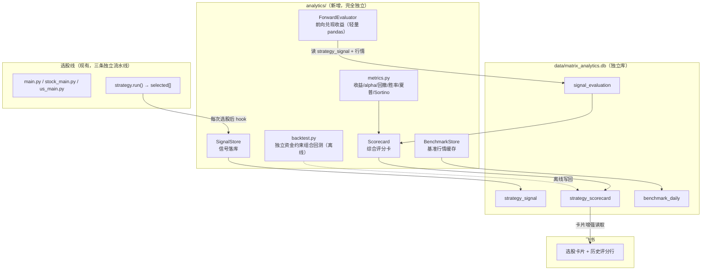

# Matrix 策略绩效分析与回测模块 | Analytics & Backtest

> 一个**完全独立**于选股流水线的绩效评估模块：把每次选股结果落库为「信号」，
> 随时间推移计算其真实兑现收益，对比基准得到 **超额收益 / 最大回撤 / 胜率 /
> 夏普 / Sortino**，汇总成每个策略的**综合评分卡**；并提供一套离线的
> 无新增依赖的资金约束历史组合回测引擎。最终目标：**每次推送飞书卡片时，能带上
> 该策略过去的真实收益与评分**。

本文档既是**设计蓝图**也记录**落地状态**：P1–P4（信号落库 → 前向兑现收益 →
评分卡 → 卡片增强）已实现并随三条选股线自动运行；P5 历史组合回测也已实现，
以独立表存储模拟收益，绝不冒充实盘或前向信号兑现结果。

**已落地组件**（`matrix_etf/analytics/` + `analytics_main.py`）：
`db.py`（独立库与前向/回测隔离表）、`signals.py`（信号落库）、`metrics.py`（指标纯函数）、
`benchmark.py`（基准缓存）、`forward.py`（前向兑现收益）、`scorecard.py`（评分卡）、
`report.py`（战绩文案）、`integration.py`（选股线容错 hook）、`backtest.py`（组合模拟）。
已接入三条选股 main
与飞书卡片，并提供 `deploy/systemd/matrix-analytics.{service,timer}`（21:30 运行）。

---

## 0. 为什么需要这个模块（实施前的差距，非当前状态）

| 能力 | 现状 | 说明 |
|---|---|---|
| strategy → signal 落库表 | ❌ 无 | 全库仅 `etf_daily / etf_basic / etf_metrics / stock_daily / stock_basic` |
| 发完飞书后持久化选股结果 | ❌ 无 | `notifier.send()` 只 build 卡片 + POST，**推完即丢** |
| 每策略建议持有天数 | ❌ 无 | `BaseStrategy` 仅 `webhook_key` + `run()→list[str]` |
| 收益 / alpha / 回撤 / 胜率 / 评分 | ❌ 无 | 没有任何绩效计算 |
| 回测库 | ❌ 无 | 依赖仅 pandas/requests/tickflow |

**关键结论**：现在选股结果推完就丢，没有任何历史信号可回溯。因此本模块第一块基石
必须是**信号落库**——没有它，一切前向绩效跟踪都无从谈起。

---

## 1. 目标与非目标

### 目标（Goals）
1. **信号持久化**：每次选股 → 落一条 `strategy_signal`（策略、市场、标的、入场日期、
   入场价、建议持有期）。
2. **前向兑现收益跟踪**：随行情推进，计算每条信号在多个持有期（如 5/10/20/60 日）
   的真实收益，并与基准同期收益对比得到超额。
3. **策略级评分卡**：把某策略近 N 条信号聚合为 **总收益 / 年化 / 超额 alpha /
   最大回撤 / 胜率 / 夏普 / Sortino / 综合评分**，落 `strategy_scorecard`。
4. **卡片增强**：推送选股卡片时，附上该策略最近一期评分卡的关键指标。
5. **离线历史回测**：复用全部 17 个策略工厂与历史封顶行情，用资金约束组合模拟，
   结果缓存进独立回测表；**按需运行，不自动部署/调度**。

### 非目标（Non-Goals）
- ❌ 不做实盘下单 / 撮合 / 资金管理。
- ❌ 不改动任何现有选股策略的**选股逻辑**（只在其外围加"记录 + 评估"）。
- ❌ 不引入实时行情；沿用 tickflow 免费档收盘后日线。
- ❌ 前向跟踪层**不引入 numba/vectorbt**（内存敏感，见 §12）。

---

## 2. 设计原则

1. **完全独立**：新建 `matrix_etf/analytics/` 包 + 独立数据库 `data/matrix_analytics.db`，
   与 ETF/A股/美股三条流水线解耦。选股线即使完全不接本模块也能正常跑；本模块
   通过一个极薄的 hook 读取选股结果。
2. **分层双腿**：
   - **前向跟踪腿**（轻量 pandas，每天在服务器上跑）→ 信号落库 + 兑现收益 + 评分卡。
   - **离线回测腿**（按需/本地跑）→ 历史复盘，结果写入独立 `backtest_*` 表。
3. **内存优先**：服务器仅 1.8G 内存 + 4G swap。前向跟踪腿只读"最近窗口"（复用
   行情；回测只加载样本期价格，策略预热使用封顶副本中的更早行情。
4. **可回退**：所有绩效计算失败只记日志，绝不阻断选股/推送主流程（与现有
   `notifier` 的容错风格一致）。

---

## 3. 总体架构


```mermaid
flowchart TD
    subgraph SELECT["选股线（现有，三条独立流水线）"]
        M1["main.py / stock_main.py / us_main.py"]
        M2["strategy.run() → selected[]"]
    end

    subgraph ANA["analytics/（新增，完全独立）"]
        direction TB
        SS["SignalStore<br/>信号落库"]
        FW["ForwardEvaluator<br/>前向兑现收益（轻量 pandas）"]
        MET["metrics.py<br/>收益/alpha/回撤/胜率/夏普/Sortino"]
        SC["Scorecard<br/>综合评分卡"]
        BM["BenchmarkStore<br/>基准行情缓存"]
        BT["backtest.py<br/>独立资金约束组合回测（离线）"]
    end

    subgraph DB["data/matrix_analytics.db（独立库）"]
        T1["strategy_signal"]
        T2["signal_evaluation"]
        T3["strategy_scorecard"]
        T4["benchmark_daily"]
    end

    subgraph OUT["飞书"]
        F1["选股卡片 + 历史评分行"]
    end

    M2 -->|"每次选股后 hook"| SS --> T1
    FW -->|"读 strategy_signal + 行情"| T2
    BM --> T4
    MET --> SC --> T3
    T2 --> SC
    T3 -->|"卡片增强读取"| F1
    BT -.->|"离线写回"| T3
```

**两腿的运行时机不同**：
- 前向跟踪腿：随每天选股/收盘后跑，轻量、常驻服务器。
- 离线回测腿：手动或本地定期跑，重、缓存结果，**不进 systemd 生产定时器**。

---

## 4. 数据模型（`data/matrix_analytics.db`）

独立库，横跨 ETF / A股 / 美股三个市场（用 `market` 字段区分）。

### 4.1 `strategy_signal` — 信号台账（一次选股一条标的一行）

```sql
CREATE TABLE IF NOT EXISTS strategy_signal (
    id                  INTEGER PRIMARY KEY AUTOINCREMENT,
    run_date            TEXT NOT NULL,      -- 选股运行日（信号产生日）YYYY-MM-DD
    market              TEXT NOT NULL,      -- 'ETF' | 'CN' | 'US'
    strategy            TEXT NOT NULL,      -- 策略类名，如 'RpsBreakoutStrategy'
    symbol              TEXT NOT NULL,      -- 标的代码，如 '600519.SH' / 'AAPL.US'
    entry_date          TEXT,              -- 实际入场交易日（run_date 的下一交易日）
    entry_price         REAL,              -- 入场价（entry_date 开盘价）
    suggested_hold_days INTEGER,           -- 该策略建议持有天数（见 §11）
    webhook_key         TEXT,              -- 冗余记录，便于溯源
    created_at          TEXT NOT NULL,     -- 落库时间戳
    UNIQUE(run_date, market, strategy, symbol)
);
CREATE INDEX IF NOT EXISTS idx_signal_strategy ON strategy_signal(market, strategy, run_date);
```

### 4.2 `signal_evaluation` — 单信号在各持有期的兑现表现

```sql
CREATE TABLE IF NOT EXISTS signal_evaluation (
    signal_id      INTEGER NOT NULL,       -- FK → strategy_signal.id
    horizon_days   INTEGER NOT NULL,       -- 持有期 5/10/20/60 …
    as_of_date     TEXT NOT NULL,          -- 计算时点（到期日或最新可得日）
    exit_price     REAL,                   -- 到期出场价
    ret            REAL,                   -- 标的区间收益率
    benchmark_ret  REAL,                   -- 同期基准收益率
    excess_ret     REAL,                   -- ret - benchmark_ret（超额）
    status         TEXT NOT NULL,          -- 'open'（未到期） | 'closed'（已到期）
    PRIMARY KEY (signal_id, horizon_days)
);
```

### 4.3 `strategy_scorecard` — 策略级聚合评分（每次评估刷新一行）

```sql
CREATE TABLE IF NOT EXISTS strategy_scorecard (
    market          TEXT NOT NULL,
    strategy        TEXT NOT NULL,
    as_of_date      TEXT NOT NULL,         -- 评分快照日
    window_days     INTEGER NOT NULL,      -- 统计窗口（如近 90 / 180 / 全部）
    sample_size     INTEGER,               -- 参与统计的（已收盘）信号数
    total_return    REAL,                  -- 组合累计收益
    ann_return      REAL,                  -- 年化收益
    excess_alpha    REAL,                  -- 相对基准的超额（见 §9）
    max_drawdown    REAL,                  -- 最大回撤（负数）
    win_rate        REAL,                  -- 胜率 [0,1]
    sharpe          REAL,
    sortino         REAL,
    composite_score REAL,                  -- 综合评分 0–100（见 §10）
    updated_at      TEXT NOT NULL,
    PRIMARY KEY (market, strategy, as_of_date, window_days)
);
```

### 4.4 `benchmark_daily` — 基准行情缓存

```sql
CREATE TABLE IF NOT EXISTS benchmark_daily (
    benchmark  TEXT NOT NULL,   -- '000300.SH' / 'SPY.US' …
    date       TEXT NOT NULL,
    close      REAL NOT NULL,
    PRIMARY KEY (benchmark, date)
);
```

---

## 5. 模块结构 `matrix_etf/analytics/`

```
matrix_etf/analytics/
├── __init__.py
├── db.py            # 独立引擎：建表 + 连接 matrix_analytics.db
├── signals.py       # SignalStore：record() 落库、查询未评估信号
├── benchmark.py     # BenchmarkStore：拉取/缓存基准日线（复用 tickflow 客户端）
├── metrics.py       # 纯函数：total_return / ann_return / max_drawdown /
│                    #          win_rate / sharpe / sortino / alpha（无 IO，易测）
├── forward.py       # ForwardEvaluator：读信号 + 行情 → 写 signal_evaluation
├── replay.py        # 历史回放：日期封顶副本重建过去信号（无前视，见 §7b）
├── scorecard.py     # ScorecardBuilder：聚合 → 写 strategy_scorecard + 综合评分
├── report.py        # 供飞书卡片读取"最近评分行"的只读查询
├── integration.py   # AnalyticsHook：选股线唯一侵入点（容错落库 + 战绩文案）
└── backtest.py      # 17 策略资金约束组合回测 + 每市场合并组合（离线）
```

`metrics.py` 是纯函数库（输入 pandas Series/DataFrame，输出标量），**不碰 IO**，
方便用 `hypothesis` 做性质测试。

---

## 6. 信号落库（对选股线的唯一侵入点）

三个 main 在 `strategy.run()` 得到 `selected` 后、`notifier.send()` 前后，加一个
**极薄且容错**的 hook：

```python
# stock_main.py 内，for strategy in strategies 循环中
selected = strategy.run()
if selected:
    try:
        signal_store.record(
            run_date=date.today().isoformat(),
            market="CN",
            strategy=type(strategy).__name__,
            symbols=selected,
            suggested_hold_days=getattr(strategy, "suggested_hold_days", None),
            webhook_key=strategy.webhook_key,
            engine=engine,   # 用于取入场价（下一交易日开盘价，或当日收盘价兜底）
        )
    except Exception as exc:      # 落库失败绝不阻断推送
        logger.warning(f"信号落库失败（不影响推送）：{exc}")
    notifier.send(...)
```

**入场价约定**：选股在 T 日收盘后运行，真实可执行的入场点是 **T+1 交易日开盘**。
落库时 `entry_date/entry_price` 可能要等 T+1 行情到位后由 `forward.py` 回填，
落库瞬间先只记 `run_date` 与标的，入场价延迟补齐（避免前视偏差 look-ahead）。

---

## 7. 前向兑现收益（`forward.py`，轻量、服务器每日跑）

每天收盘同步完行情后：
1. 查所有 `status='open'` 或尚未到期的信号。
2. 对每条信号：
   - 若入场价未补齐且 T+1 行情已到 → 回填 `entry_date/entry_price`。
   - 对每个 `horizon_days`（5/10/20/60）：若已到到期日 → 取出场价，算 `ret`；
     否则用最新价算"浮动收益"并保持 `status='open'`。
   - 用 `benchmark_daily` 取同期基准收益 → 算 `excess_ret`。
   - upsert 进 `signal_evaluation`。

**内存**：只按需读取涉及标的的最近窗口行情（复用 §12 思路），逐市场/逐批处理，
绝不全表载入。

### 7b. 历史回放与前向信号隔离（`replay.py`）

`python analytics_main.py --replay --days 20` 现在是 `--backtest` 的兼容别名：
不再填充 `strategy_signal`、不调用前向评估器、不联网同步基准。
旧版回放已写入的历史信号不会自动删除；需要纯前向样本时请显式区分旧数据库来源。

历史副本通过 **SQLite backup API** 创建，包含已提交但尚未 checkpoint 的 WAL 数据。
按日期从新到旧裁剪 `daily.date > as_of`，所有逐只 OHLCV 和直接 SQL 查询都受同一
日期上限约束。仅含最新快照的 `etf_metrics` 缓存会清空，避免把今日指标带回历史。
退出或异常都会恢复引擎路径、清理工作副本，不修改行情记录。

所有策略在每个历史日期先共同调用 `strategy/ranking.py::select_recommendations`，
每市场最多 `recommendation_limit`（默认 10）个唯一标的。排名只用封顶 OHLCV 和当日
策略共识；21 根有效日线预热要求也按历史可见数据计算。
`--strategy` **只筛选展示，不减少参与排名或存储的策略**，从而与全量回测保持可比。
市场过滤可以节约耗时，策略过滤不会加速历史选股。完整组合与持仓口径见 §12。

---

## 8. 指标定义与公式（`metrics.py`）

先由每策略"当前持仓"构造一条**等权组合日收益序列** `r_t`：某信号从 `entry_date`
持有到 `entry_date + hold_days`，期间计入组合；每日组合收益 = 当日在持所有标的
日收益的等权均值。基于 `r_t` 与其净值曲线 `E_t = ∏(1+r_i)`：

| 指标 | 公式 | 说明 |
|---|---|---|
| 总收益 total_return | `∏(1+r_t) − 1` | 组合累计 |
| 年化 ann_return | `(1+total_return)^(252/T) − 1` | T=交易日数 |
| 波动率 vol | `std(r_t) · √252` | 年化 |
| 夏普 sharpe | `(ann_return − r_f) / vol` | `r_f` 无风险利率，默认 0 |
| Sortino | `(ann_return − r_f) / (下行标准差·√252)` | 只惩罚 `r_t<0` 的波动 |
| 最大回撤 max_drawdown | `min_t( E_t / max_{i≤t}E_i − 1 )` | 负数 |
| 胜率 win_rate | `#{已收盘信号 ret>0} / #{已收盘信号}` | 逐信号口径 |
| 超额 alpha | 见 §9 | 相对基准 |

> 无风险利率 `r_f`、年化交易日 252 均做成可配置项（美股/ A 股可分别设定）。

---

## 9. 基准对比与超额 alpha

| 市场 | 默认基准 | 备选 |
|---|---|---|
| A 股（CN） | 沪深300 `000300.SH` | 中证500 `000905.SH` |
| ETF | 沪深300 `000300.SH` | 与所选 ETF 风格匹配的宽基 |
| 美股（US） | 标普500 `SPY.US` | 纳指100 `QQQ.US` |

超额提供两种口径，评分卡默认用**简单超额**，CAPM alpha 作为可选进阶：
- **简单超额**：`excess_alpha = ann_return_strategy − ann_return_benchmark`
- **CAPM alpha**（可选）：对 `r_p = α + β·r_b + ε` 做最小二乘回归取 `α`（年化）。

基准行情由 `benchmark.py` 通过现有 tickflow 客户端拉取并缓存进 `benchmark_daily`，
避免每次评估重复请求。

---

## 10. 综合评分卡（`scorecard.py`）

把多维指标归一到 **0–100** 的 `composite_score`。默认采用**固定映射 + 加权**
（避免跨策略 z-score 在样本少时不稳定）：

```
score = 100 · clip(
      0.30 · norm(ann_return,   lo=-0.20, hi=0.60)   # 年化
    + 0.25 · norm(excess_alpha, lo=-0.20, hi=0.40)   # 超额
    + 0.20 · norm(sharpe,       lo=-0.5,  hi=2.5)     # 夏普
    + 0.10 · norm(sortino,      lo=-0.5,  hi=3.5)     # Sortino
    + 0.10 · win_rate                                 # 胜率本就 [0,1]
    + 0.05 · norm(max_drawdown, lo=-0.40, hi=0.0)     # 回撤（越浅越高）
, 0, 1)

其中 norm(x, lo, hi) = clip((x − lo) / (hi − lo), 0, 1)
```

- 权重与 `lo/hi` 边界全部做成配置项，便于按市场调参。
- **样本保护**：`sample_size < min_samples`（默认 10）时，`composite_score` 记 `NULL`
  并在卡片上标注"样本不足"，不给误导性高分。

---

## 11. 每策略建议持有天数（`suggested_hold_days`）

给 `BaseStrategy` 增加一个类属性（默认 `None`），各策略按其风格覆盖：

```python
class BaseStrategy(ABC):
    webhook_key: str = "default"
    suggested_hold_days: int | None = None   # 新增，绩效评估的默认到期口径
```

建议初值（**待你确认**，可后续按回测结果回调）：

| 类型 | 策略 | 建议持有天数 |
|---|---|---|
| 动量/RPS | `RpsBreakout` / `UsRpsMomentum` / `RpsMomentum` | 20 |
| 趋势/均线 | `TrendMa` / `MaVolume` / `UsTrendMa` | 20–30 |
| 突破 | `BreakoutVolume` / `Turtle` / `HighTightFlag` | 10–20 |
| 均值回归/短线 | `MeanReversion` / `LimitUpShakeout` | 5–10 |

前向评估仍会对**所有** horizon（5/10/20/60）都算一遍，`suggested_hold_days`
只是卡片/评分卡默认展示的那一档。

---

## 12. 历史资金组合回测（`backtest.py`，已实现、无新增依赖）

默认复用三条选股入口的工厂：ETF 7、A 股 6、美股 4，共 **17 个策略**。
每策略独立初始账户，另有每市场 `__market_portfolio__` 去重合并账户；
不将人民币与美元账户简单相加，不把各策略收益平均冒充总组合收益。

### 资金、交易与估值

- `--days N` 取行情库最后 N 个不同交易日期（CLI 默认 60）；之前的历史仅用作策略预热。
  第一日收盘前账户全现金，无样本前隐含持仓；最后日信号无法成交并单独计数。
- 收盘信号只能在**下一市场交易日开盘**成交，不在信号日收盘买入。该标的缺开盘价、
  零/负/非有限价格则取消订单，不向未来找一根更有利的开盘价。
- 每个账户初始资金默认 100,000，最多 10 个持仓，不加杠杆、不做空、现金不可负。
  单笔预算 = 上一日收盘权益 / 最大持仓数，且不超过当前现金，包含买入费用。
  按推荐顺序尝试成交；同标的已持有时不加仓也不延长到期日；无容量的订单取消。
  支持零碎份额，不模拟交易所手数/最小委托数量。
- 使用策略 `suggested_hold_days` / 集中映射：H 个**市场交易日**，
  开仓日算第 1 日，在第 H 日收盘卖出，H=1 为开仓日收盘。
  开盘买入先于收盘卖出，因此当天平仓款不能资助当天开盘买入。
  合并账户同一信号日重复标的取最长建议持有期，按策略工厂顺序合并各自排序；
  此后重复推荐不延期。
- 双边佣金默认各 5 bps，双边滑点默认各 5 bps。买入价为 open×(1+滑点)，
  卖出价为 close×(1−滑点)，另扣成交额佣金。可由 CLI 配置，不暗含额外税费。
- 到期缺有效收盘价则顺延到下一有效收盘，标记缺价警告；无法估值时携带最后有效价
  （新仓至少有当日开盘价）。期末未到期仓位正常按市价估值、**不强平**，不扣假想卖出费；
  缺价未平仓/陈旧期末价格明确标记 `partial`，不以零价或未来价伪造兑现结果。
- **总收益** = 期末现金及未平仓市值 / 初始资金 − 1。
  **年化** = (期末权益 / 初始资金)^(252/(交易日数−1)) − 1；单日无收益区间时为 N/A。
  **最大回撤**为含初始现金基线的逐日收盘权益/历史最高权益−1 的最小值（负数）。
  同时展示样本起止、交易日数、开仓/平仓/未平仓数；短样本年化不可靠。

### 状态与失败

每个注册策略始终有一行：`ok`、`no_signals`（含预热不足或排序剔除，现金收益 0）、
`no_trades`（有信号但无成交）、`partial`（缺价等问题）、
`no_data` / `error`（没有可回测数据或策略失败，收益 N/A，**不是 0**）。
策略抛异常会破坏共识排名，因此整个市场标记失败，不悄悄剔除坏策略再宣称盈利；
仍持久化错误报告、继续其他市场，CLI 最终以非零码退出。
策略内部自行过滤的无效标的不构成异常，预热不足不会被冒充有历史业绩。

### 独立持久化与限制

`backtest_run` 保存配置、样本期、完整 Markdown；`backtest_result` 保存所有策略的
摘要、历史信号、跳单/成本/数据覆盖情况；`backtest_equity` 存每日现金与权益；
`backtest_trade` 存完整成交与期末未平仓记录。相同输入结果生成同一内容哈希 run ID，
重复执行幂等；不同结果/配置保留独立运行。报告同时写到绩效库目录下
`backtests/<market>-<run_id>.md`，`--report` 可重新查看各市场最近一次报告。
不会写入前向 `strategy_signal`、`signal_evaluation` 或 `strategy_scorecard`。

仅读取本地行情，**不需要基准网络或飞书 webhook 配置**，不会创建/迁移行情源库。
样本期的成交价格通过 SQLite `INSERT SELECT` 流式写入独立工作文件，仅存日期、
代码、开盘与收盘价；模拟按持仓/订单按需查询，缓存最多 2,048 条价格，
**不把 12,000 只股票×60 日的全市场行情列表载入 Python 内存**。
未来成交价不在策略可访问的封顶库内。工作文件和封顶副本在成功/异常退出时均清理。
CLI 的 SIGTERM（如 systemd 超时）会触发正常上下文清理；SIGKILL/断电仍可能留下文件。
不会自动删除其他进程或旧版回放的工作文件。
需为当前市场的完整数据库副本和样本期价格投影预留磁盘空间（市场顺序执行）。
工作副本会保守地按标的裁剪：保留「策略所需观察数 + 本次回放交易日数」。
RPS 的 SQL 日历窗口额外按 `int((period + 60) * 1.6) + 1` 根作为上界保留，
避免早期回放日的横截面数据被误删。默认 20 日回放为 ETF 每标的至少 221 根、
CN/US 至少 309 根；60 日对应至少 261/349 根。自定义周期会扩大保留量，
未知策略以及 Mega7 保留区间中存在无效 close/amount 的标的不做历史裁剪。
采用 `(symbol,date)` 索引定位和分批删除，不做全市场 `ROW_NUMBER` 排序；
不 VACUUM，故工作文件物理大小可能不变，但后续查询只扫描保留的有效表页。
行情投影也优先逐标的索引读取样本期；起止日期与覆盖数复用日历/标的元数据，
不额外执行全表 MIN/MAX/COUNT 聚合扫描。
`history.py` 对已登记的有限窗口策略按需读取最近有效历史：默认 ETF/US 至多 201 根、
A 股至多 121 根；自定义周期会扩大窗口，Mega7 缺失 close/amount 时向前补足有效行。
RPS 的按标的读取同样保证至少 `period + 1` 根，不依赖其内部采用直接 SQL 还是引擎读取。
每个信号日复用一个 SQLite 读连接、一次符号列表，不缓存全市场 DataFrame；
未知策略保持完整历史读取。测试与完整历史读取逐策略比较选股结果。
股票/美股 RPS 另以 SQLite 游标逐标的流式计算，只将每只标的最新指标汇入横截面排名；
不再构造全市场历史 DataFrame，原收益、均线、成交额和排名公式保持不变。
裁剪日期时利用已有 `(symbol,date)` 索引对当日受影响标的执行删除，避免每天全表 DELETE 扫描。
60 日是运行成本折中，不是全市场运行时间承诺：历史选股仍按日期×策略×标的数增长，
RPS 和历史快照扫描仍有计算成本。建议先 `--market ETF --days 5` 检查数据，
再在独立任务中运行 60 日，勿与行情同步争用小内存服务器。
需要尽快获得全部策略的首份资金回测，可先 `--backtest --days 3`，随后再扩展至 20/60；
短样本包含未平仓估值，年化不具代表性，不能代替长样本验证。
这不是交易所撮合：未建模停牌/涨跌停可成交性、冲击/成交量参与率、税费、FX、
复权/现金分红与退市回收。当前本地标的池存在幸存者偏差；历史数据不足、错误复权、
陈旧行情会使回测失真。报告称为**模拟**，绝不等同实盘收益。

---

## 13. 飞书卡片增强

`notifier.send()` 增一个可选入参（或在 build_card 内查 `report.py`）：推送某策略
选股卡片时，附一行该策略最近评分卡：

```
━━━━━━━━━━━━━━━
📊 前向信号跟踪（非实盘）近90日：年化 +18.4% | 超额 +6.1% | 胜率 58% | 夏普 1.32 | 评分 72
（基于 46 条已记录信号的行情兑现，不代表实盘成交）
```

- 评分数据由 `report.get_latest_scorecard(market, strategy)` 只读查询获得。
- 查不到（新策略/样本不足）→ 不追加该行，卡片退回现有样式，**永不因此报错**。
- 如有已保存回测，独立追加「🧪 历史组合回测（模拟，非实盘）：总收益 …」，
  即使前向样本为零也会展示；失败/缺价状态一并展示，不受前向最小样本数限制。
- 前向信号兑现与历史组合模拟明确分开；两者都不是券商实盘账户收益。

---

## 14. 新增配置项（`core/config.py`）

```python
# —— 绩效分析 ——
analytics_enabled: bool = True                 # 总开关
analytics_db_path: str = "data/matrix_analytics.db"
analytics_horizons: list[int] = [5, 10, 20, 60]
analytics_windows: list[int] = [90, 180]       # 评分卡统计窗口（天）
analytics_min_samples: int = 10                # 低于此不给综合评分
analytics_risk_free: float = 0.0               # 年化无风险利率
analytics_trading_days: int = 252
# 基准
benchmark_cn: str = "000300.SH"
benchmark_us: str = "SPY.US"
# 评分权重（可分市场覆盖）
score_weights: dict = {...}                     # §10 的六项权重
```

---

## 15. 运行方式与调度

新增独立入口 `analytics_main.py`（与三个选股 main 平级、互不依赖）：

```bash
python analytics_main.py --evaluate      # 前向：刷新兑现收益 + 评分卡（服务器每日）
python analytics_main.py --sync-benchmark # 仅更新基准行情缓存
python analytics_main.py --backtest --days 252           # 全部 17 策略 + 3 市场组合
python analytics_main.py --backtest --market ETF --days 60
python analytics_main.py --backtest --market CN --strategy rps --days 252
python analytics_main.py --backtest --market US --days 252 --initial-capital 100000 \
  --max-positions 10 --commission-bps 5 --slippage-bps 5
python analytics_main.py --replay --days 20              # --backtest 的兼容别名
python analytics_main.py --report                        # 前向评分卡 + 最近组合回测
```

**部署（服务器）**：
- 新增 `matrix-analytics.timer/.service`，在三条选股线**全部收盘同步完成之后**触发
  （例如 A 股线 20:30、ETF 19:15 之后，排到 **21:30** 跑 `--evaluate`），错峰、内存不打架。
- `matrix-backtest.timer` 每周日 04:00 运行 `--backtest --days 60`，低优先级、
  12 小时超时，内存上限 400 MB、交换空间上限 128 MB；也可手动运行。
- 回测与前向评估通过 `run_analytics.sh` 共用分析锁，避免重叠；`--replay` 是兼容别名，
  不会通过历史模拟增加前向样本数。

---

## 16. 测试策略

| 层 | 测试点 |
|---|---|
| `metrics.py` | 纯函数：已知序列的 sharpe/sortino/最大回撤/胜率精确值；hypothesis 性质测试（收益全正→回撤=0 等） |
| `signals.py` | 落库幂等（UNIQUE 约束）、重复选股不重复入库 |
| `forward.py` | 构造 mini 行情 + 信号，验证 5/10/20 日兑现收益与 open/closed 状态流转 |
| `scorecard.py` | 聚合正确、样本不足→评分 NULL、边界归一化 clip |
| 集成 | 选股 hook 落库失败不阻断推送；卡片查不到评分时不报错 |
| `backtest.py` | 已知净值曲线、佣金/滑点、现金/重叠/重复约束、缺价/期末估值、历史封顶/WAL、17 策略零信号、失败、幂等独立存储 |

沿用现有 `uv run --extra dev pytest` + `uvx ruff check .`（line-length 100）。

---

## 17. 分阶段实施计划

| 阶段 | 内容 | 依赖 | 上服务器 | 状态 |
|---|---|---|---|---|
| **P1 地基** | `analytics/db.py` + `strategy_signal` 表 + `SignalStore.record()` + 三 main 落库 hook + `suggested_hold_days` | 无 | ✅ | ✅ 已实现 |
| **P2 前向收益** | `benchmark.py` + `metrics.py` + `forward.py` + `signal_evaluation` | P1 | ✅ | ✅ 已实现 |
| **P3 评分卡** | `scorecard.py` + `strategy_scorecard` + `analytics_main.py --evaluate` + timer | P2 | ✅ | ✅ 已实现 |
| **P4 卡片增强** | `report.py` + `notifier` 追加战绩行 | P3 | ✅ | ✅ 已实现 |
| **P5 历史回测** | 17 策略共享历史排序 + `backtest.py` 资金组合 + 独立表/报告 | P1 | 手动/离线 | ✅ 已实现 |

P1–P4 用轻量 pandas，可安全上 1.8G 服务器；P5 是可选增强，离线跑。

> **实现口径说明**：§8 描述的是逐日组合净值序列口径；P1–P4 落地时采用更易测试、
> 内存更省的**逐笔口径**——每个到期平仓的信号按其 `suggested_hold_days` 记为一笔
> 交易收益，`periods_per_year = trading_days / hold_days`，夏普/Sortino 以 √ppy
> 年化。逐笔平均收益不能代表有资金/重叠限制的组合总收益；
> P5 使用真实模拟现金账户的逐日净值，两个口径始终分开展示。

---

## 18. 已定稿的关键决策

以下决策已确认并落地（初值可后续微调）：

1. **建议持有天数**：采用 §11 初值（均落在 5/10/20/60），集中于 `strategy/hold_days.py`。
2. **入场价口径**：T+1 开盘（避免前视偏差）。
3. **基准**：A 股/ETF = 沪深300（`000300.SH`），美股 = 标普500（`SPY.US`）。
4. **评分权重**：采用 §10 默认权重（年化 .30 / 超额 .25 / 夏普 .20 / Sortino .10 /
   胜率 .10 / 回撤 .05），可经 `SCORE_WEIGHT_*` 覆盖。
5. **实施节奏**：P1–P4 与 P5 已实现；回测按需运行，不自动部署。

---

## 附：与现有系统的边界

- **独立库**：`matrix_analytics.db` 与 `matrix.db / matrix_stock.db / matrix_us.db` 平级，
  互不干扰；删了它选股线照常跑。
- **唯一侵入**：三个 main 各加约 10 行容错 hook + `BaseStrategy` 加一个类属性，
  不触碰任何策略的选股算法。
- **容错一致**：所有绩效逻辑失败只 `logger.warning`，绝不 `raise` 影响推送。
