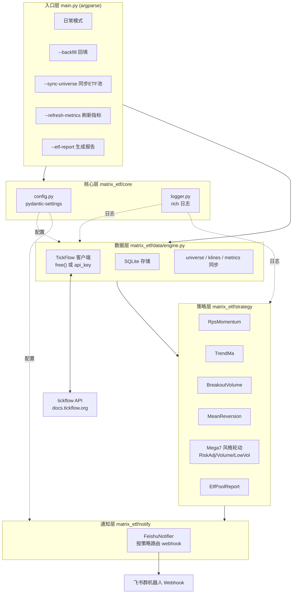
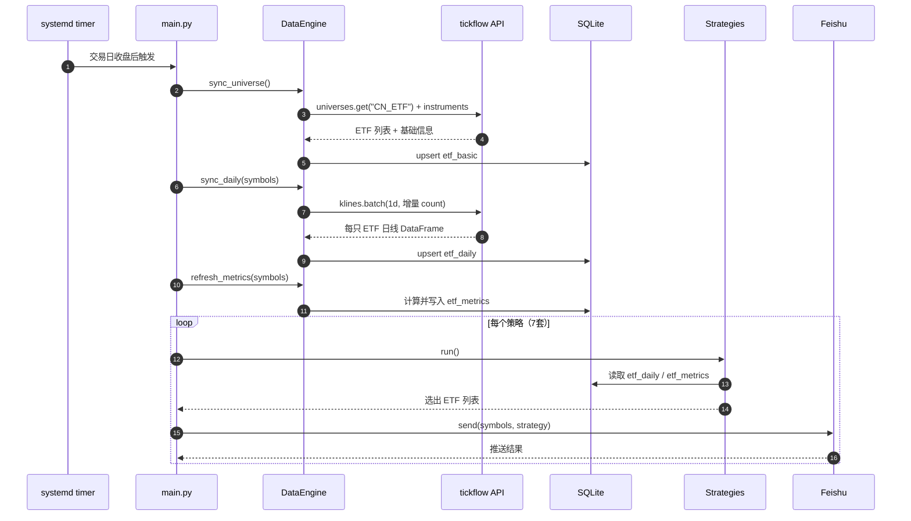
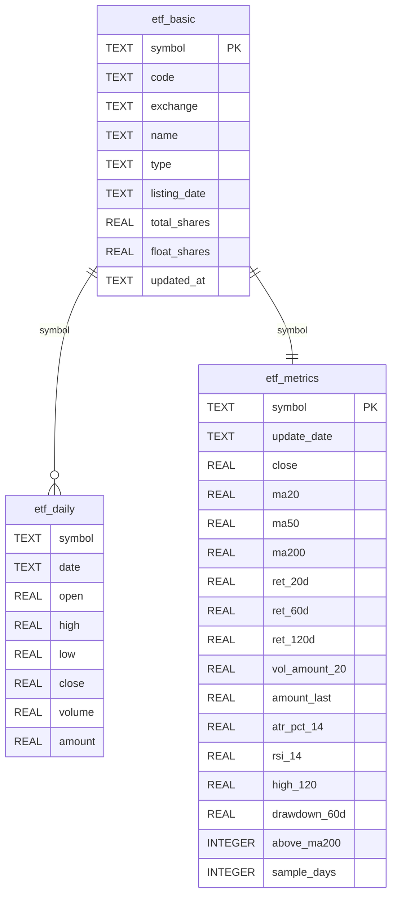
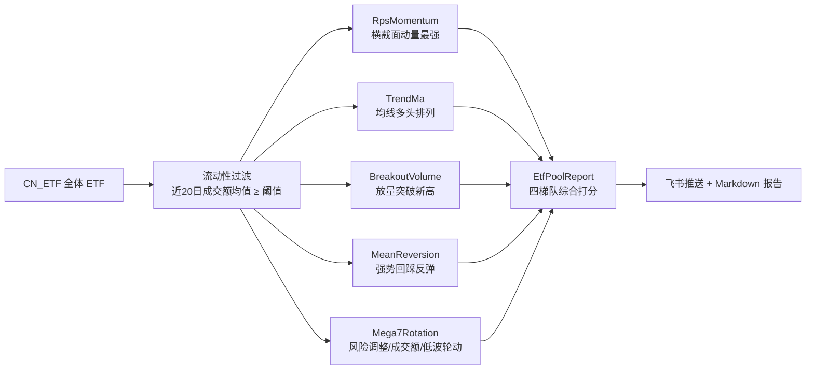
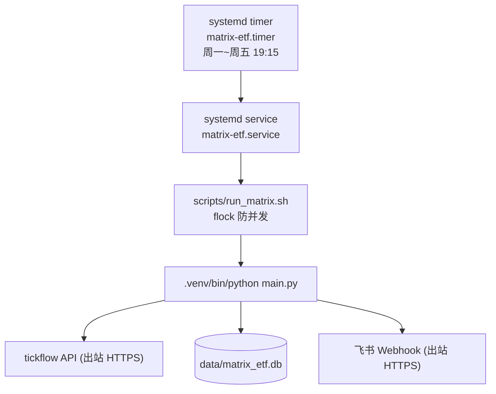
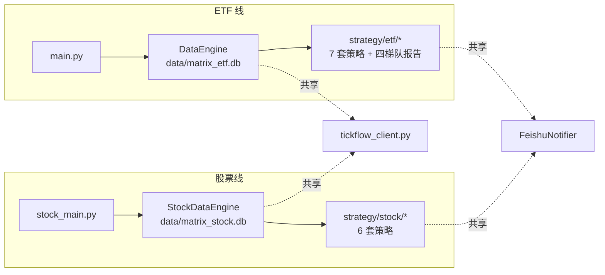

# Matrix 架构设计 | Architecture

> Matrix 是一套 ETF + A 股推荐系统：使用 [tickflow](https://github.com/tickflow-org/tickflow)
> 作为唯一行情数据源，收盘后同步日线，运行技术型选股策略，并把结果推送到飞书。

本项目在工程结构上参考 NebulaStock，但**数据源完全改为 tickflow，彻底摒弃 baostock**。
系统按金融产品种类拆成两条**完全独立**的流水线：ETF 线（`main.py` + `DataEngine` +
`strategy/etf/`）与股票线（`stock_main.py` + `StockDataEngine` + `strategy/stock/`），
各自维护数据库、标的池与策略集。两条线均以**价格、成交量、成交额**等技术与动量指标为主
（ETF 无 PE/PB/ROE 等基本面字段；股票线目前也只用价量信号，暂不接入基本面）。

---

## 1. 系统分层

---

## 2. 日常运行数据流

---

## 3. 数据模型（SQLite）

- `etf_daily` 以 `(symbol, date)` 唯一约束，写入使用 upsert，避免重复与误删。
- `etf_metrics` 每只 ETF 一行，预聚合趋势/动量/流动性指标，供报告和策略快速筛选。
- RPS（相对强度）为**横截面**指标，在策略/报告运行时对全体 ETF 的收益率排名计算，不落库。

---

## 4. 策略体系概览

策略详细规则见 [etf_strategy.md](etf_strategy.md)，数据源细节见 [data_source.md](data_source.md)。

---

## 5. 部署拓扑（Alibaba Cloud Linux）

部署步骤见 [../README.md](../README.md)。

---

## 6. 设计取舍

| 决策 | 原因 |
|------|------|
| 数据源用 tickflow free 服务 | ETF 日线免费、无需注册、部署简单；如需实时/分钟线可切换 API key |
| 标的用 `CN_ETF` 池 | tickflow 官方维护的沪深 ETF 全集（约 1500+ 只） |
| 只做技术/动量策略 | ETF 无个股基本面字段，价量数据是唯一可靠信号 |
| 用成交额做流动性过滤 | 剔除迷你/僵尸 ETF，保证可交易性 |
| 指标预聚合进 `etf_metrics` | 报告与筛选无需每次重算长周期指标 |
| SQLite 本地存储 | 单机部署、可直接拷贝迁移、零运维 |
| systemd timer 而非 crontab | 与阿里云 Linux 原生集成、日志统一、可持久化补跑 |

---

## 7. 股票线（stock_main.py）

股票线与 ETF 线**完全解耦**：独立入口、独立数据库、独立标的池、独立策略集，
共享的是 tickflow 客户端工厂（`data/tickflow_client.py`）、策略基类
（`strategy/base.py`）、飞书通知（`notify/feishu.py`）与交易日历。

- 标的池：`CN_Equity_A`（tickflow 免费服务，约 5500 只全 A 股，symbol 形如 `600519.SH`）。
- 数据表：`stock_daily`（`(symbol, date)` 唯一约束，upsert）与 `stock_basic`（基础信息 + 名称）。
  股票线不计算 `*_metrics` 指标——各策略直接从 `get_ohlcv` 现算所需指标。
- 六套策略（原创重写，思路借鉴 NebulaStock）：均线放量 `stock_ma_volume`、海龟突破
  `stock_turtle`、高旗形整理 `stock_flag`、涨停洗盘 `stock_shakeout`、上升趋势跌停
  `stock_limit_down`、RPS 动量突破 `stock_rps`。webhook key 统一带 `stock_` 前缀，
  与 ETF 推送互不干扰。
- RPS 为**横截面**策略：一次性读取全市场 `stock_daily` 做涨幅百分位排名 + 阶段新高突破。

股票策略详细规则见 [stock_strategy.md](stock_strategy.md)。
